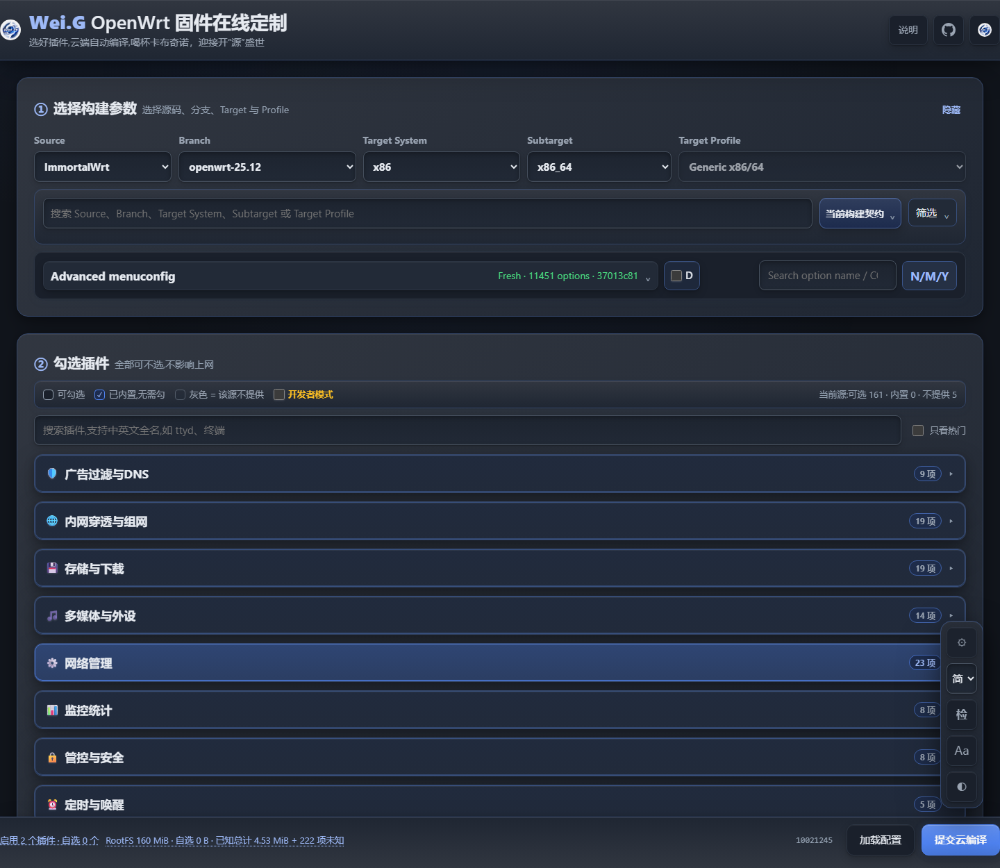
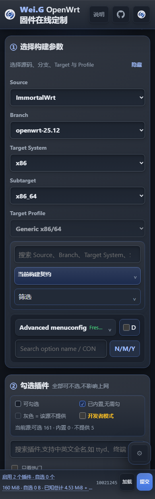

# Wei.G OpenWrt 固件在线定制

在网页选择设备和插件，提交 GitHub 请求，让云端为你编译 OpenWrt 固件。

📱 桌面与手机适配 · 🌙 明暗主题 · 📂 导入已有配置 · 🔎 配置检查与兼容性推荐

**[🌐 在线定制](https://www.weigshare.com/wrt/) · [⬇️ 固件下载 / 查看构建](https://github.com/weigefenxiang/WeiG-OpenWrt-AutoBuild/actions/workflows/custom-build.yml)**

语言：[English](README.en.md) · 简体中文

> 刷机前先确认完整型号、硬件版本和刷机方法，并备份当前配置。名称相似的设备不一定通用；社区固件不保证适用于你的设备。

## 界面预览

### 电脑端

### 手机端

## 新手使用：五步生成自己的固件

### 1. 选择设备

打开 [在线定制页面](https://www.weigshare.com/wrt/)，依次选择源码（Source）、版本（Branch）、Target System、Subtarget 和 Target Profile。

**以设备官方资料和对应源码的支持列表为准，不要凭名字猜型号。** 插件和机型是否提供，由所选源码、版本和设备决定。

### 2. 勾选插件，或加载已有配置

在“② 勾选插件”选择需要的功能；不会选时，可以保持默认。高级选项放在 **Advanced menuconfig**，不熟悉的选项不必修改。

已有配置可点击 **加载配置**，选择 `build-request.json`、旧版请求 JSON、`.config` 或 `config.buildinfo`，再确认源码与版本。加载后检查设备、插件和 RootFS 容量，旧配置不一定适合新源码。

底栏区分实际启用与自选插件，点击可查看清单。有可靠数据时显示软件包已知安装大小；未知项不算作零，估算也不等于最终固件大小。

### 3. 填写设置并检查

按需填写管理地址、时区、主题和构建标识；构建标识用于找到自己的固件。

点击右侧 **“检”**。出现推荐时先查看原因，再应用并重新检查；需要人工判断的问题不要直接忽略。加载失败时可下载加载日志帮助排查。

> 不要把真实密码、访问令牌或其它私密信息上传到公开 Issue、请求文件和日志。

### 4. 提交云编译

点击 **提交云编译 → 下载请求并打开 GitHub**。

网页会下载 `build-request.json` 并打开 Issue 页面。登录 GitHub，把刚下载的文件上传到 Issue，然后提交。**只下载文件而没有创建 Issue，不会开始云编译。**

也可以选择“仅下载 .config”，保存配置自行编译；它不会启动云端任务。

### 5. 找到并下载固件

打开 [Actions → Firmware Download / 固件下载](https://github.com/weigefenxiang/WeiG-OpenWrt-AutoBuild/actions/workflows/custom-build.yml)，按构建标识和 Issue 编号找到自己的 Run。

等待构建完成后，在 Run 页面底部的 **Artifacts** 下载固件压缩包（GitHub 通常要求登录），解压后按设备对应的刷机方法使用。产物保留 **60 天**，请及时保存。

**红色 Run 不代表一定有可用固件。** 先查看失败步骤和 `BUILD-LOGS`，不要把日志、配置或其它辅助产物当成固件刷入。

## 常见问题

找不到我的设备或插件？

可用项取决于源码、版本和设备。确认完整型号与所选版本；不要用近似型号替代。没有提供的插件不能保证强行启用后能编译。

为什么没有显示插件大小？

不是所有源、版本和架构都提供可靠的安装大小。页面会区分加载中、加载失败和缺少匹配数据；失败时可以重试。没有大小不影响查看已启用插件清单，也不会凭空显示 0 B。

修改旧配置后，应该重跑旧 Run 吗？

不要用旧 Run 验证新配置。请在当前网页重新加载、检查、导出请求并创建新 Issue；旧 Run 重跑仍使用原请求锁定的代码和数据。

## 开发与部署

普通用户无需克隆仓库或安装 Node.js。克隆部署、项目配置、数据架构和测试说明见 [开发者指南](../docs/DEVELOPER.md) 与 [架构说明](../ARCHITECTURE.md)。

源码与插件数据来自 [Menuconfig Catalog](https://github.com/weigefenxiang/WeiG-OpenWrt-Menuconfig-Catalog)。

## 鸣谢与许可证

[OpenWrt](https://github.com/openwrt/openwrt) · [ImmortalWrt](https://github.com/immortalwrt/immortalwrt) · [Lean LEDE](https://github.com/coolsnowwolf/lede) · [hanwckf mt798x](https://github.com/immortalwrt/immortalwrt-mt798x) · LuCI 及所有插件作者。

本项目采用 [GNU GPLv3 或更高版本](../LICENSE)。版权与联系方式见 [NOTICE](../NOTICE)。
